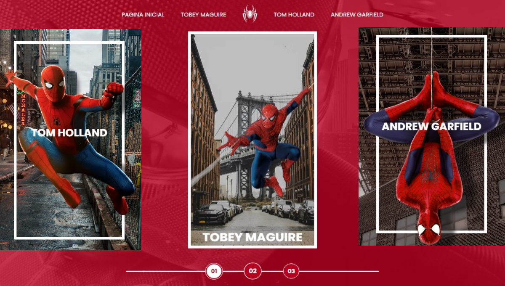
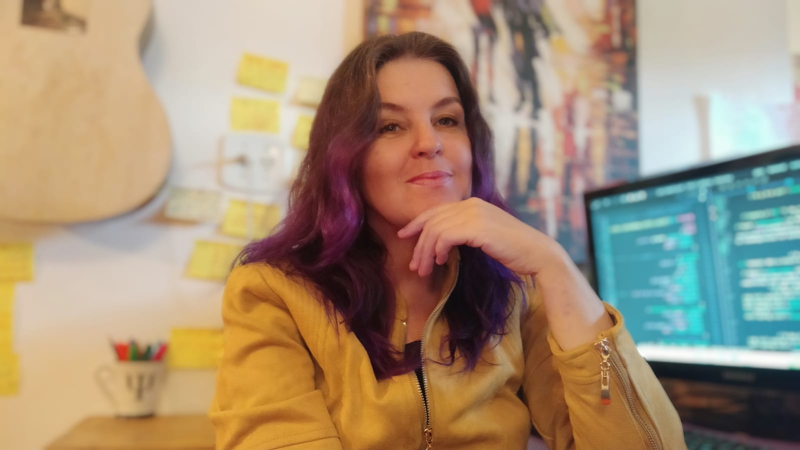

<h1 align="center"> SPIDER-MAN  MULTIVERSO </h1>

 Status <☕> MVP de 12 à 21 maio 2022 <☕/>
 

TO DO: Responsividade + Tratamento de peso Imgs Gdes + WCAG

# 
### Descrição
- Cards dos três Spider-Man: Tobey Maguire, Andrew Garfield e Tom Holland, com informações (sinopses, fotos e traillers) sobre seus respectivos filmes.

- O layout desse projeto foi proposto por: Michele Ambrosio & Diogo M. Mainardes. 
- Gravação das liveCodings da DIO nos links abaixo:
https://www.youtube.com/watch?v=a29-lfFi9Qc&t=0s
https://www.youtube.com/watch?v=0IY5TJwAbcQ

## 📁 Acessibilidade:
- Para acessar os códigos fontes basta acessá-los diretamente nas pastas desse repositório.     
- Para navegar na page, clique na imagem abaixo com o *scroll* ou com o botão direito do mouse para abrir em nova aba:
<table align="center">
  <tr>
    <td>
      
    </td>
  </tr>
</table>

## :hammer_and_wrench: Tecnologias Utilisadas:
# JavaScript | HTML5 | CSS3
## :octocat: Autora: 
<table>
  <tr>
    <td align="center">
      <a href="#">
         
        
          <b>Debh Valois</b>
        
      </a>
    </td>
  </tr>
</table>

